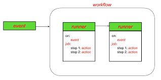

# CI/CD Knowledge

## Gitflow
<details>
  <summary>Main branches</summary>
  <br/>
  
  + **Main:** This branch contains the production-ready code. All releases are tagged here.
  + **Develop:** This branch serves as an integration branch for features. It contains the latest delivered development changes for the next release.
</details>
<details>
  <summary>Supporting Branches</summary>
  <br/>
  
  + **Feature Branches:** Created from the `develop` branch, these branches are used to `develop` new features. Once a feature is complete, it is merged back into `develop`.
  + **Release Branches:** Created from the `develop` branch when a set of features is ready for a release. This branch allows for final testing and bug fixing before merging into `main` and `develop`.
  + **Hotfix Branches:** Created from the `main` branch to quickly address critical issues in production. Once fixed, changes are merged back into both `main` and `develop`.
</details>
<details>
  <summary>Workflow</summary>
  <br/>
  
  + **Initialization:** Start by creating the `develop` branch from `main`.
  + **Feature Development:** Developers create feature branches from `develop`, work on their features, and merge them back into `develop` when done.
  + **Release Preparation:** When ready for a release, create a release branch from `develop`, perform final testing and fixes, then merge into both `main` and `develop`.
  + **Hotfixes:** For urgent fixes, create a hotfix branch from `main`, apply the fix, and merge back into both `main` and `develop`.
  
</details>

## Github Action
### Architecture

<details>
  <summary>Overview</summary>
  <br/>
  
  
  
</details>

<details>
  <summary>Key concepts</summary>
  <br/>

  + **Workflow:** A workflow is a configurable automated process that consists of one or more jobs.
  + **Events:** Events are specific activities in a repository that trigger workflows.
  + **Step:** Steps are individual tasks within a job. They can run commands or actions (reusable extensions).
  + **Actions:** Actions are reusable units of code that perform specific tasks. They can be used within steps to simplify workflows.
  + **Jobs:** A job is a set of steps that run as part of your workflow. Recall that a step can run a task, a command, or an action.
  + **Runner:** A runner is a machine, either hosted by GitHub or self-hosted, that executes the jobs in a workflow.
  
</details>

### Using Github Actions

<details>
  <summary>Managing Secrets</summary>
  <br/>
  
  **Manage:**
  
  1. Go to your repository on GitHub.
  2. Click on the **Settings** tab.
  3. In the left sidebar, click on **Secrets and variables > Actions**.
  4. Click on **New repository secret**.
  5. Add a name for your secret and its value, then click Add secret.

  **Use:**

  To use a secret in your workflow, reference it in your YAML file like this:
  ```
  jobs:
  build:
    runs-on: ubuntu-latest
    steps:
    - name: Checkout code
      uses: actions/checkout@v2

    - name: Use secret
      run: echo ${{ secrets.MY_SECRET }}
  ```

  _Note:_ Always use secrets for sensitive information like API keys, tokens, and passwords.
</details>

<details>
  <summary>Managing Environment Variables</summary>
  <br/>

  **Environment-Specific Variables:** Navigate to **Settings > Environments**, create an environment.
  **Environment Variables in Workflow:** You can define environment variables directly in your workflow file.

  ```
  jobs:
    build:
      runs-on: ubuntu-latest
      env:
        MY_VARIABLE: 'value'
      steps:
      - name: Checkout code
        uses: actions/checkout@v2
  
      - name: Use environment variable
        run: echo $MY_VARIABLE
  ```
</details>
<details>
  <summary>Caching</summary>
  <br/>

  Caching in GitHub Actions is a mechanism that allows you to store and reuse files or data between workflow runs.

  1. **Cache Creation:** During a workflow run, you can create a cache by specifying a unique key. This key is used to identify the cache.
  2. **Cache Storage:** The cache is stored on GitHub’s servers.
  3. **Cache Restoration:** In subsequent workflow runs, the cache can be restored using the same key, allowing you to reuse the stored data.

  ```
  name: Java CI

  on: [push, pull_request]
  
  jobs:
    build:
      runs-on: ubuntu-latest
  
      - name: Cache Maven dependencies
        uses: actions/cache@v3
        with:
          path: ~/.m2/repository
          key: ${{ runner.os }}-maven-${{ hashFiles('**/pom.xml') }}
          restore-keys: |
            ${{ runner.os }}-maven-
  ```
  _The actions/cache@v3 action caches the Maven dependencies located in the ~/.m2/repository directory._

</details>

<details>
  <summary>Matrix builds</summary>
  <br/>

</details>
<details>
  <summary>Parallel Jobs</summary>
  <br/>

  You can define multiple jobs within the jobs section of your workflow YAML file.

  ```
  name: Parallel Jobs Example

  on: [push]
  
  jobs:
    job1:
      runs-on: ubuntu-latest
      steps:
        - name: Checkout code
          uses: actions/checkout@v2
        - name: Run tests
          run: echo "Running tests for job1"
  
    job2:
      runs-on: ubuntu-latest
      steps:
        - name: Checkout code
          uses: actions/checkout@v2
        - name: Build project
          run: echo "Building project for job2"
  ```

</details>
<details>
  <summary>Security for CI/CD pipeline</summary>
  <br/>
  
  + Store sensitive information like API keys, tokens, and passwords in GitHub Secrets.
  + Integrate security tools like CodeQL, Snyk, or Gitleaks to automatically scan your code for vulnerabilities.

</details>

### Github Actions with ECS

<details>
  <summary>Setup ECS & ECR</summary>
  <br/>

  1. Create an ECR Repository
  2. Create an ECS Cluster
  3. Dockerize Java Application (_Create a Dockerfile_)
  5. Create access key from user. (_there are several ways to get credentails from AWS_)
  6. Create ECS Task Definition ([Task definition sample file](sample-service-task-definition-revision1.json))
  7. Finally, we create github actions workflow.

  ```
    FROM openjdk:17-jdk-alpine
    COPY target/sample-service*.jar app.jar
    ENTRYPOINT ["java","-jar","/app.jar"]
  ```
  _This file will define how to build your Docker image._
  
</details>
<details>
  <summary>Setup CI/CD</summary>
  <br/>

  ```
name: Java CI with SonarQube

on:
  push:
    branches:
      - lite_version
      - ecs_version

jobs:
  build:
    runs-on: ubuntu-latest
    permissions:
      packages: write
      contents: read
      id-token: write

    steps:
      - name: Checkout code
        uses: actions/checkout@v2

      - name: Get commit message
        id: get_commit_message
        run: echo "::set-output name=message::$(git log -1 --pretty=%B)"

      - name: Check commit message
        if: contains(steps.get_commit_message.outputs.message, 'Build CI')
        run: echo "Commit message contains the trigger phrase!"

      - name: Set up JDK 17
        uses: actions/setup-java@v2
        with:
          java-version: '17'
          distribution: 'temurin'

      - name: Cache Maven packages
        uses: actions/cache@v2
        with:
          path: ~/.m2
          key: ${{ runner.os }}-maven-${{ hashFiles('**/pom.xml') }}
          restore-keys: ${{ runner.os }}-maven

      - name: Build with Maven
        run: mvn -B package --file pom.xml

      - name: Run tests and generate JaCoCo report
        run: mvn test jacoco:report
  
      - name: Publish JaCoCo report
        uses: actions/upload-artifact@v4
        with:
          name: jacoco-report
          path: target/site/jacoco
          
      - name: Configure AWS credentials
        uses: aws-actions/configure-aws-credentials@master
        with:
          aws-access-key-id: ${{ secrets.AWS_ACCESS_KEY }}
          aws-secret-access-key: ${{ secrets.AWS_SECRET_ACCESS_KEY }}
          aws-region: ${{ vars.AWS_REGION }}

      - name: Login to Amazon ECR
        id: login-ecr
        uses: aws-actions/amazon-ecr-login@v2
        with:
          mask-password: 'true'
          
      - name: Build, tag, and push image to Amazon ECR
        env:
          ECR_REGISTRY: ${{ steps.login-ecr.outputs.registry }}
          ECR_REPOSITORY: ${{ vars.ECR_REPOSITORY }}
          IMAGE_TAG: latest
        run: |
          docker build -t $ECR_REGISTRY/$ECR_REPOSITORY:$IMAGE_TAG .
          docker push $ECR_REGISTRY/$ECR_REPOSITORY:$IMAGE_TAG
          echo "image=$ECR_REGISTRY/$REPOSITORY:$IMAGE_TAG" >> $GITHUB_OUTPUT

      - name: Fill in the new image ID in the Amazon ECS task definition
        id: task-def
        uses: aws-actions/amazon-ecs-render-task-definition@v1
        with:
          task-definition: task-definition.json
          container-name: my-java-app
          image: ${{ steps.ecr-login.outputs.registry }}/my-java-app:latest

      - name: Deploy Amazon ECS task definition
        uses: aws-actions/amazon-ecs-deploy-task-definition@v1
        with:
          task-definition: ${{ steps.task-def.outputs.task-definition }}
          service: my-java-app-service
          cluster: my-cluster
          wait-for-service-stability: true
  ```
</details>
